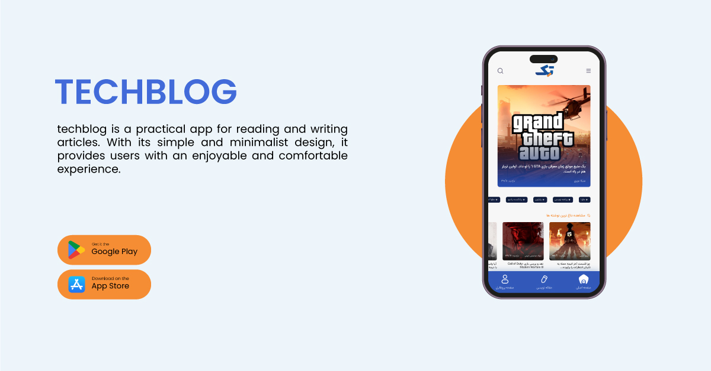

# 💻️ Techblog
    TechBlog App is an Android app that allows you to read a variety of articles on a variety of topics. This app includes articles on entertainment, news, games, movies, and other topics.
Star⭐ the repo if you like what you.

## ✨ Requirements
* Any Operating System (ie. MacOS X, Linux, Windows)
* Any IDE with Flutter SDK installed (ie. IntelliJ, Android Studio, VSCode etc)
* A little knowledge of Dart and Flutter

## 📸 ScreenShots

## 🤓 Author
🌴 Mohammad Haghighi 

